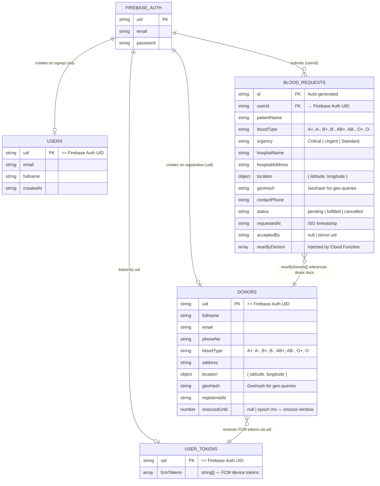
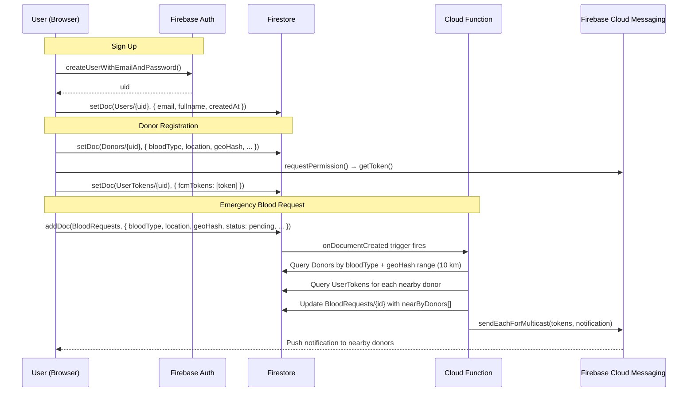

# LifeLink — Entity Relationship Diagram

> **Database:** Cloud Firestore (NoSQL document store)
> All collections use the authenticated user's `uid` (from Firebase Auth) as the document ID where noted.

---

## Collections Overview

| Collection | Document ID | Description |
|---|---|---|
| `Users` | `uid` | Basic profile created at signup |
| `Donors` | `uid` | Donor registration profile |
| `UserTokens` | `uid` | FCM push notification tokens |
| `BloodRequests` | Auto-generated | Emergency blood requests |

---

## ER Diagram (Mermaid)



---

## Collection Field Details

### `Users/{uid}`
| Field | Type | Notes |
|---|---|---|
| `uid` | `string` | Document ID = Firebase Auth UID |
| `email` | `string` | From Firebase Auth |
| `fullname` | `string` | Entered at signup |
| `createdAt` | `string` | ISO timestamp |

---

### `Donors/{uid}`
| Field | Type | Notes |
|---|---|---|
| `uid` | `string` | Document ID = Firebase Auth UID |
| `fullname` | `string` | Donor's full name |
| `email` | `string` | From Firebase Auth |
| `phoneNo` | `string` | Contact number |
| `bloodType` | `string` | `A+`, `A-`, `B+`, `B-`, `AB+`, `AB-`, `O+`, `O-` |
| `address` | `string` | Home/area address |
| `location` | `map` | `{ latitude: number, longitude: number }` |
| `geoHash` | `string` | Geohash of location for geo-range queries |
| `registeredAt` | `string` | ISO timestamp of registration |
| `snoozedUntil` | `number \| null` | Epoch ms; donor hidden from searches until this time |

---

### `UserTokens/{uid}`
| Field | Type | Notes |
|---|---|---|
| `uid` | `string` | Document ID = Firebase Auth UID |
| `fcmTokens` | `string[]` | Array of FCM device tokens (supports multiple devices) |

---

### `BloodRequests/{autoId}`
| Field | Type | Notes |
|---|---|---|
| `id` | `string` | Auto-generated document ID |
| `userId` | `string` | FK → Firebase Auth UID of requester |
| `patientName` | `string` | Name of the patient |
| `bloodType` | `string` | Blood group needed |
| `urgency` | `string` | `Critical`, `Urgent`, or `Standard` |
| `hospitalName` | `string` | Hospital / facility name |
| `hospitalAddress` | `string` | Full hospital address |
| `location` | `map` | `{ latitude: number, longitude: number }` |
| `geoHash` | `string` | Geohash for geo-range queries |
| `contactPhone` | `string` | Emergency contact number |
| `status` | `string` | `pending` → `fulfilled` or `cancelled` |
| `requestedAt` | `string` | ISO timestamp |
| `acceptedBy` | `string \| null` | UID of donor who accepted (future use) |
| `nearByDonors` | `Donor[]` | Array injected by `bloodRequestReceived` Cloud Function |

---

## Data Flow Diagram



---

## Relationships Summary

```
Firebase Auth (uid)
  │
  ├──[1:1]──▶  Users/{uid}          (profile data)
  │
  ├──[1:1]──▶  Donors/{uid}         (donor registration + geo location)
  │              │
  │              └──[1:1]──▶  UserTokens/{uid}   (FCM push tokens)
  │
  └──[1:N]──▶  BloodRequests/{autoId}  (emergency requests)
                 │
                 └──[N:N via array]──▶ nearByDonors[]  (computed by Cloud Function,
                                                         references Donor documents)
```

> **Note:** Firestore is a NoSQL document store — there are no enforced foreign keys. Relationships are maintained by convention (shared `uid`) and enforced through Firestore Security Rules.
