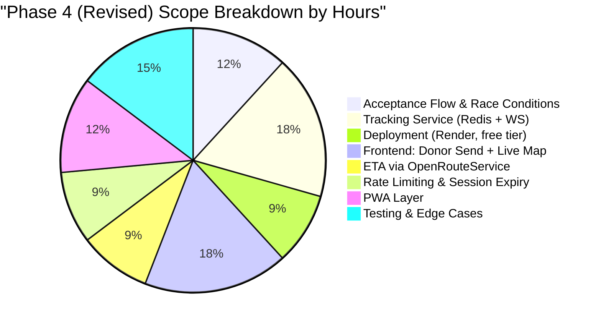

# 🚀 LifeLink: Phase 4 (Revised) — Live Tracking & PWA Roadmap

This document supersedes the original **Phase 4 (Days 26–35)** plan. The original roadmap called for Firebase RTDB-based tracking; based on architecture discussion, Phase 4 has been redesigned around a **self-hosted Redis pub/sub + WebSocket tracking service**, layered on top of the existing Firebase stack (Firestore, Cloud Functions, FCM remain untouched). A new **Phase 4.5 (PWA)** has also been added, which was not in the original 45-day plan.

Paced at **7–8 hrs/week** rather than full-time days, so phases are broken into **weeks**, not day-ranges.

---

## 📊 Phase 4 (Revised) Completion Snapshot



---

## 🏗️ Architecture Decision Record

> [!IMPORTANT]
> **Decision: Redis pub/sub + WebSocket service, not Firebase RTDB**
> The original roadmap's RTDB plan was zero-new-infra but weaker as a systems-design story. A small dedicated Node/WebSocket service was chosen instead — it does exactly one job (hold connections, relay location via Redis) and leaves Firestore/Cloud Functions/FCM fully intact as the system of record for request lifecycle.

> [!TIP]
> **Decision: Render free tier now, Fly.io later**
> No paid hosting until the project is closer to production or generating income. Render's free web-service tier accepts a 30–60s cold start in exchange for $0 cost. Because the tracking service is plain Node + `ws` + `ioredis` with no platform-specific code, migrating to Fly.io later (for always-on / scale-to-zero speed) is expected to take ~1–2 hours: swap env vars, repoint the frontend's WebSocket URL, redeploy. No feature work is blocked by deferring this.

> [!NOTE]
> **Decision: OpenRouteService for ETA, not Google Directions**
> Google Directions free tier was exhausted. OpenRouteService (OSM-based, free public instance, no card required) replaces it as a drop-in ETA source. ETA is recalculated only on movement/time thresholds (>200m moved or >30s elapsed), not on every location ping, to control request volume.

> [!NOTE]
> **Decision: PWA over React Native, testing on Android only**
> No iOS device available for testing; Android Chrome install-prompt behavior is the only target for now. iOS Safari's "Add to Home Screen" flow differs and is explicitly out of scope until a device is available to test on.

> [!NOTE]
> **Decision: No custom domain yet**
> Ships on default Render/Vercel subdomains (`*.onrender.com`, `*.vercel.app`). Domain purchase deferred to a later production-readiness pass.

```mermaid
graph TD
    subgraph Existing Firebase Stack (unchanged)
        W[React Web App]
        FS[(Firestore)]
        CF[Cloud Functions]
        FCM[Firebase Cloud Messaging]
        W -->|Auth, Requests, Matching| FS
        CF -->|Match & Notify| FS
        CF -->|Push Payloads| FCM
        FCM -->|Alerts| W
    end

    subgraph New: Tracking Layer
        TS[Tracking Service<br/>Node + ws]
        R[(Redis pub/sub)]
        ORS[OpenRouteService API]
        TS <-->|publish/subscribe| R
        TS -->|ETA on movement threshold| ORS
        W <-->|WebSocket, active requests only| TS
    end

    FS -.->|status: accepted triggers session start| TS
```

---

## 📅 Week-by-Week Breakdown

### Prerequisite: Close out original Phase 3 — `[ ] NOT STARTED`
*Goal: Don't build tracking on top of an unresolved matching pipeline.*
- `[ ]` Donor availability / snooze toggle (web + mobile)
- `[ ]` Firebase Auth integrated in Expo mobile app

---

### Week 1: Request Acceptance Flow — `[ ] PENDING` *(~4 hrs)*
*Goal: Resolve who "owns" a request before any tracking begins.*
- `[ ]` Add `status` and `acceptedDonorId` fields to `BloodRequests` schema
- `[ ]` Implement accept-request as a **Firestore transaction** to prevent double-accept races when multiple donors tap "Accept" simultaneously
- `[ ]` Add Accept/Decline actions to the donor inbox UI

---

### Week 2: Tracking Service Core — `[ ] PENDING` *(~6 hrs)*
*Goal: A working local WebSocket + Redis relay, no deployment yet.*
- `[ ]` Scaffold Node + `ws` + `ioredis` service; one "room" per active `requestId`
- `[ ]` Donor client publishes location → Redis; requester clients subscribed to the same room receive updates
- `[ ]` Run and test entirely on localhost with two browser tabs simulating donor/requester

---

### Week 3: Deploy + Frontend Wiring — `[ ] PENDING` *(~6 hrs, split ~3/3)*
*Goal: Service is live on the public internet and the UI reflects real movement.*
- `[ ]` Deploy tracking service to **Render (free tier)**; read `PORT` and `REDIS_URL` from environment, never hardcoded
- `[ ]` Provision Redis (Render add-on or in-container instance — no persistence needed)
- `[ ]` (Optional, dev-only) Set up an UptimeRobot ping to reduce cold-start friction while actively testing
- `[ ]` Requester-side: live-updating map marker (Leaflet) driven by incoming WebSocket messages
- `[ ]` Donor-side: geolocation watcher that sends pings only while a request is in `accepted` status

---

### Week 4: ETA + Guardrails — `[ ] PENDING` *(~6 hrs, split ~3/3)*
*Goal: The privacy, rate-limiting, and cost-control requirements from the original brief.*
- `[ ]` Integrate OpenRouteService for route + ETA
- `[ ]` Throttle ETA recalculation to movement/time thresholds (not every ping)
- `[ ]` Server-side rate limit on donor location writes (hard floor, independent of client-side interval)
- `[ ]` Session expiry: auto-close tracking room on `status → fulfilled`, or after a fixed time-box, whichever comes first
- `[ ]` Confirm location sharing is opt-in and never visible to anyone but the matched requester

---

### Week 5: PWA Layer — `[ ] PENDING` *(~4 hrs)*
*Goal: Installable, notification-first experience on Android.*
- `[ ]` Add `manifest.json` (name, icons, `display: standalone`, theme color)
- `[ ]` Extend existing FCM service worker to also handle install/offline caching (no second push system)
- `[ ]` Capture `beforeinstallprompt`; show custom "Add to Home Screen" CTA at a sensible moment
- `[ ]` Basic offline app-shell caching via Workbox
- `[ ]` Test install flow on Android Chrome only

---

### Week 6: Testing, Edge Cases & Buffer — `[ ] PENDING` *(~5 hrs)*
*Goal: Absorb the inevitable WebSocket/Redis debugging overrun.*
- `[ ]` Test full flow end-to-end: request → accept → live tracking → fulfillment → session teardown
- `[ ]` Handle donor GPS permission denial gracefully
- `[ ]` Handle WebSocket disconnect/reconnect (e.g., donor's phone loses signal briefly)
- `[ ]` Verify rate limiting and expiry actually fire under simulated conditions
- `[ ]` Buffer time for cross-environment (dev vs. deployed) WebSocket quirks

---

## 🎯 Deferred to a Later "Production Readiness" Pass

> [!NOTE]
> These are explicitly **not** part of this roadmap — revisit only once closer to real users or income:
> - Migrate tracking service: Render → Fly.io (always-on, scale-to-zero, ~$2–3/mo)
> - Purchase and configure a custom domain
> - iOS Safari PWA install testing
> - Load-testing the 50+ simultaneous active-request scale scenario

---

## 📈 Resume Bullets (draft — confirm numbers once measured)

- Designed a real-time donor location tracking system using Redis pub/sub and WebSockets, decoupled from the core Firebase backend, supporting live ETA updates during emergency blood requests.
- Implemented Firestore transactions to resolve concurrent request-acceptance race conditions among multiple donors.
- Converted the web app into an installable PWA with offline caching, reusing the existing FCM push infrastructure rather than maintaining a parallel push system.
- Migrated the tracking service from a free-tier host to a scale-to-zero production host as part of a cost-aware infrastructure progression *(add once actually done)*.
